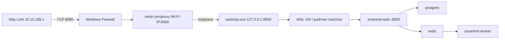

# Triển khai smart-pdf2md qua LAN (Podman trên Windows)

Hướng dẫn vận hành stack web trên máy Windows + Podman (WSL), cho phép máy khác trong mạng nội bộ truy cập qua HTTP.

## Kiến trúc

Container publish cổng `8000` bên trong VM WSL; trên Windows, `wslrelay.exe` chỉ bind `127.0.0.1:8000`. Máy LAN không vào được trực tiếp — cần **portproxy** từ IP Wi-Fi → loopback, kèm firewall giới hạn subnet.



```
Máy LAN ──TCP:8000──► Windows Firewall (cho phép 10.15.188.0/23)
                              │
                              ▼
                    netsh portproxy
                    <Wi-Fi-IP>:8000 ──► 127.0.0.1:8000 (wslrelay)
                              │
                              ▼
                    WSL / podman machine ──► smartmd-web:8000
                                              ├── postgres
                                              └── redis ──► worker
```

**Lưu ý bảo mật:** mật khẩu và file PDF đi qua LAN dạng plaintext (HTTP). Chỉ dùng trong mạng nội bộ tin cậy. Firewall rule `smartmd LAN 8000` giới hạn nguồn `10.15.188.0/23`.

## Yêu cầu trước khi mở LAN

- Stack compose đã chạy (`web`, `worker`, `postgres`, `redis`); `/healthz` trả `{"status":"ok"}` trên `http://127.0.0.1:8000`.
- PowerShell **Run as administrator** khi chạy script expose/unexpose.
- Service **IP Helper** (`iphlpsvc`) đang `Running` (script sẽ cố start nếu dừng).
- Đăng ký công khai tắt (`WEB_ALLOW_REGISTER=false`): admin tạo user qua `/admin`.

## Khởi động / dừng hằng ngày

### Bật stack

```powershell
# 1. Máy Podman (sau reboot hoặc wsl --shutdown)
podman machine start

# 2. Vào thư mục project, bật compose
cd D:\projects\smartmd
podman compose up -d

# 3. Kiểm tra health local
curl http://127.0.0.1:8000/healthz
```

### Mở ra LAN (khi cần / khi IP đổi)

IP Wi-Fi thường lấy qua DHCP. Mỗi lần IP đổi, chạy lại expose:

```powershell
# PowerShell as Administrator, từ thư mục project
.\scripts\lan-expose.ps1
```

Script sẽ:

1. Kiểm tra quyền admin và `iphlpsvc`
2. Tự dò IPv4 của adapter `Wi-Fi`
3. Tạo/cập nhật portproxy `<IP>:8000` → `127.0.0.1:8000`
4. Tạo/cập nhật firewall rule `smartmd LAN 8000` (RemoteAddress `10.15.188.0/23`)
5. In URL dùng trên LAN, ví dụ `http://10.15.189.7:8000`

Portproxy lưu trong registry — sau reboot thường vẫn còn. Vẫn nên kiểm tra:

```powershell
netsh interface portproxy show v4tov4
```

Nếu IP Wi-Fi đã khác với `listenaddress` trong bảng, chạy lại `lan-expose.ps1`.

### Tắt LAN (giữ stack local)

```powershell
# PowerShell as Administrator
.\scripts\lan-unexpose.ps1
```

Gỡ portproxy (theo IP Wi-Fi hiện tại) và firewall rule `smartmd LAN 8000`.

Nếu IP đã đổi và còn rule cũ trên IP cũ:

```powershell
.\scripts\lan-unexpose.ps1 -AllPortProxiesOnPort
```

### Dừng stack

```powershell
cd D:\projects\smartmd
podman compose down
# tuỳ chọn: podman machine stop
```

## Tạo người dùng

1. Đăng nhập tài khoản admin tại `http://<IP>:8000/login` (hoặc `http://127.0.0.1:8000` trên máy host).
2. Vào `/admin`.
3. Tạo từng tài khoản qua form tạo user; cấp credits theo nhu cầu.
4. Không mở đăng ký công khai khi phát nội bộ (`WEB_ALLOW_REGISTER=false`).

## Xem log

```powershell
podman logs -f smartmd-web-1
podman logs -f smartmd-worker-1
podman logs -f smartmd-postgres-1
podman logs -f smartmd-redis-1
```

Tên container có thể khác nếu project name đổi — liệt kê bằng `podman ps`.

## Backup volume

Dữ liệu quan trọng nằm trong volume Podman (tên có thể có prefix project, ví dụ `smartmd_pgdata`):

```powershell
# Liệt kê volume
podman volume ls

# Backup Postgres
podman volume export smartmd_pgdata -o pgdata-backup.tar

# Backup web data (PDF, Markdown, OCR cache)
podman volume export smartmd_webdata -o webdata-backup.tar
```

Khôi phục (máy đích đã có volume trống cùng tên):

```powershell
podman volume import smartmd_pgdata pgdata-backup.tar
podman volume import smartmd_webdata webdata-backup.tar
```

`smartmd_webdata` phình theo thời gian (PDF gốc + cache OCR) — theo dõi dung lượng đĩa WSL.

## Scale worker (nhiều job song song)

Mỗi worker xử lý một job tại một thời điểm:

```powershell
podman compose up -d --scale worker=2
```

## Checklist xử lý sự cố

| Triệu chứng | Nguyên nhân thường gặp | Cách xử lý |
|-------------|------------------------|------------|
| Máy khác timeout, host local vẫn OK | IP Wi-Fi đổi → portproxy trỏ sai | Chạy lại `.\scripts\lan-expose.ps1` (admin); so khớp `netsh interface portproxy show v4tov4` với `Get-NetIPAddress -AddressFamily IPv4 -InterfaceAlias Wi-Fi` |
| Script báo lỗi IP Helper / portproxy không hoạt động | Service `iphlpsvc` dừng | `Get-Service iphlpsvc`; `Start-Service iphlpsvc`; chạy lại expose |
| Timeout dù portproxy + firewall đúng | AP client isolation trên Wi-Fi (chặn máy-tới-máy) | Thử mạng dây / SSID nội bộ khác; nhờ IT tắt isolation. Không sửa được chỉ bằng cấu hình Windows |
| `/healthz` local fail | Stack chưa lên hoặc web crash | `podman compose ps`; `podman logs smartmd-web-1`; `podman compose up -d` |
| Không đăng nhập được (cookie) | `COOKIE_SECURE=true` trên HTTP | Giữ `COOKIE_SECURE=false` khi chưa có TLS |
| Worker lỗi OCR / VLM | Thiếu `OPENCODE_API_KEY` hoặc hết mạng ra ngoài | Kiểm tra `.env` và log worker |
| OOM / container bị kill khi OCR | RAM WSL thấp | Nâng `memory` trong `%USERPROFILE%\.wslconfig`, rồi `wsl --shutdown` → `podman machine start` → `podman compose up -d` |
| Script expose báo không phải admin | PowerShell thường | Mở PowerShell **Run as administrator**, chạy lại |

### Kiểm tra nhanh trên host

```powershell
netsh interface portproxy show v4tov4
Get-NetFirewallRule -DisplayName 'smartmd LAN 8000'
Get-Service iphlpsvc
Get-NetTCPConnection -LocalPort 8000 -ErrorAction SilentlyContinue
curl http://127.0.0.1:8000/healthz
```

Từ máy khác cùng subnet: mở `http://<IP-Wi-Fi-host>:8000/healthz`, kỳ vọng `{"status":"ok"}`.

## Tóm tắt lệnh thường dùng

| Việc | Lệnh |
|------|------|
| Start machine | `podman machine start` |
| Up stack | `podman compose up -d` |
| Expose LAN | `.\scripts\lan-expose.ps1` (admin) |
| Unexpose | `.\scripts\lan-unexpose.ps1` (admin) |
| Logs worker | `podman logs -f smartmd-worker-1` |
| Backup DB | `podman volume export smartmd_pgdata -o pgdata-backup.tar` |
